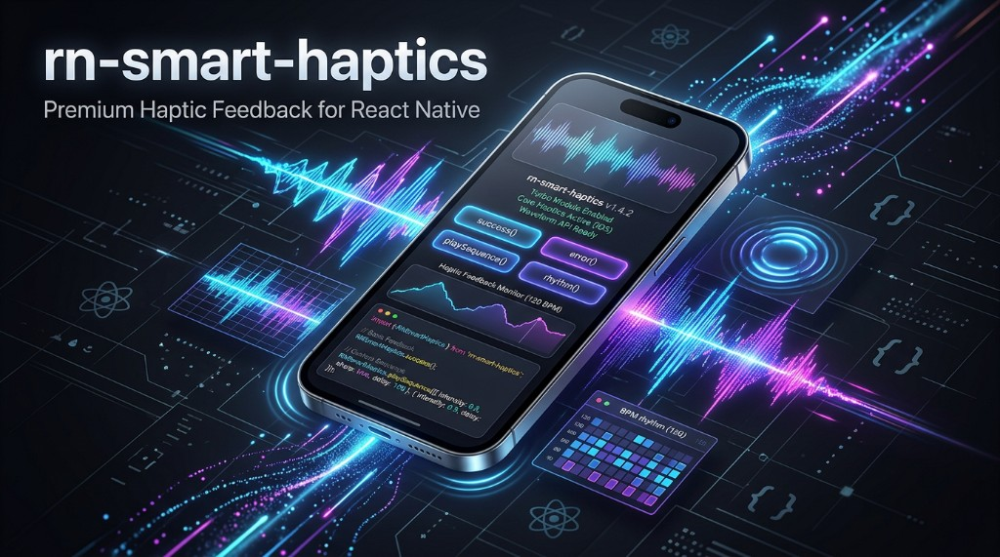

# rn-smart-haptics

[](https://www.npmjs.com/package/rn-smart-haptics)
[](https://github.com/iuzairaslam/rn-smart-haptics/blob/main/LICENSE)
[](https://www.typescriptlang.org/)
[](https://reactnative.dev/)



Rich **haptic patterns** for React Native: **named presets**, **custom impact sequences**, and **rhythm** playback. Ships as a **New Architecture Turbo Module** with **Core Haptics** on iOS and **waveform vibration** (with amplitudes) on Android—without leaning on the legacy bridge for playback scheduling.

## Table of contents

- [Why this library?](#why-this-library)
- [Features](#features)
- [Requirements](#requirements)
- [Installation](#installation)
- [Native setup (iOS)](#native-setup-ios)
- [Native setup (Android)](#native-setup-android)
- [Quick start](#quick-start)
- [Troubleshooting](#troubleshooting)
- [API](#api)
- [Validation & limits](#validation--limits)
- [Example app](#example-app)
- [Platform notes](#platform-notes)
- [Development](#development)
- [Publishing (maintainers)](#publishing-maintainers)
- [Versioning & stability](#versioning--stability)
- [License](#license)

## Why this library?

- **Modern RN**: Turbo Modules / Fabric-friendly—aligned with React Native **0.76+** where New Architecture is the default trajectory.
- **Beyond six presets**: Build polish comparable to native banking / fitness apps with sequences and BPM-driven pulses—not only “light / medium / heavy”.
- **Sensible fallbacks**: iOS uses UIKit feedback generators when `CHHapticEngine` is unavailable; Android degrades waveform APIs on older API levels.

## Features

| Area | Details |
|------|---------|
| **Presets** | `success`, `error`, `warning`, `celebration`, `lightImpact`, `mediumImpact`, `heavyImpact`, `rigid`, `soft`, `selection`, `doubleTap`, `tick` |
| **Sequences** | JSON-backed steps: `impact` (intensity 0–1, sharpness 0–1) and `pause` (ms) |
| **Rhythm** | `bpm`, repeating `pattern` (truthy = pulse), total `duration` (ms) |
| **Safety** | JS validation (`LIMITS`, `HapticsValidationError`) plus native caps on payload size, step counts, and waveform length |

## Requirements

| Requirement | Version |
|-------------|---------|
| `react` | ≥ **18** |
| `react-native` | ≥ **0.76** (Turbo Modules / **New Architecture**) |
| **iOS** | ≥ **13** (Core Haptics); typical RN apps target higher |
| **Android** | **API 21+**; amplitude waveforms use **API 26+** where available |

> **Old Architecture** (Paper-only) is **not** supported—this module is codegen / Turbo Module based.

## Installation

### npm / Yarn (recommended)

```bash
npm install rn-smart-haptics
# or
yarn add rn-smart-haptics
```

Then complete **Native setup** below and **rebuild** your app (a JS-only reload is not enough).

### Expo

Use an Expo SDK whose React Native supports **New Architecture** for your app (often **SDK 52+**). Enable New Architecture per Expo docs for your version.

```bash
npx expo install rn-smart-haptics
```

Rebuild native binaries (`expo prebuild`, EAS Build, or dev client)—this library ships **Objective-C++**, **Kotlin**, and generated code.

### Local path (monorepo)

```json
"rn-smart-haptics": "file:../rn-smart-haptics"
```

From the library root run **`yarn prepare`** once so **`lib/`** exists before the host app bundles.

### GitHub Packages (optional)

If you publish or consume from **GitHub Packages**, configure `.npmrc` for your scope and registry, then install the name your registry uses.

## Native setup (iOS)

You do **not** manually edit `AppDelegate` or link CocoaPods targets for this library—**autolinking** handles it.

1. Install the npm package (see above).
2. Install pods after native dependencies change:
   ```bash
   cd ios && pod install && cd ..
   ```
3. Build and run:
   ```bash
   npx react-native run-ios
   ```
4. **Debug + Metro**: start the bundler in another terminal:
   ```bash
   npx react-native start
   ```
   If the simulator cannot open Metro in a new terminal automatically, either pass `--terminal` per the CLI message or keep Metro running manually.

The pod **`RnSmartHaptics`** links **Core Haptics** (no extra Xcode framework steps).

## Native setup (Android)

Autolinking registers the module; the library’s manifest contributes **`VIBRATE`** (merged into your app—usually **no** manual manifest edit).

1. Install the npm package.
2. Rebuild the app:
   ```bash
   cd android && ./gradlew assembleDebug && cd ..
   npx react-native run-android
   ```
3. **Debug + Metro**: keep the dev server running (`npx react-native start`). On a **physical device** over USB, forward the packager port so the phone can reach your computer:
   ```bash
   adb reverse tcp:8081 tcp:8081
   ```

## Quick start

```tsx
import Haptics from 'rn-smart-haptics';

await Haptics.success();

await Haptics.playSequence([
  { type: 'impact', intensity: 0.4, sharpness: 0.8 },
  { type: 'pause', duration: 80 },
  { type: 'impact', intensity: 0.9, sharpness: 0.3 },
]);

await Haptics.rhythm({ bpm: 90, pattern: [1, 0, 1, 1], duration: 2000 });
```

## Troubleshooting

| Symptom | What to try |
|--------|-------------|
| **“No script URL provided” / blank screen (iOS)** | Start **Metro** (`npx react-native start`), then reload the app (**⌘R** in the simulator) or rebuild. The example app pins a fallback URL in Debug; you still need Metro for the bundle. |
| **Red screen / cannot load bundle (Android device)** | Run **`adb reverse tcp:8081 tcp:8081`** while USB-connected; ensure Metro is listening on **8081**. |
| **Haptics feel weak or missing** | **Simulator** haptics are limited—use a **physical** iPhone or Android device for real feedback. |
| **Build errors after upgrading** | `cd ios && pod install`, clean build folders, rebuild Android. |

## API

### Default export

`Haptics` exposes async methods returning **`Promise<void>`** (resolve when playback is **scheduled** on the native side).

### Named exports

```ts
import Haptics, {
  HapticsValidationError,
  LIMITS,
  type SequenceStep,
  type RhythmConfig,
} from 'rn-smart-haptics';
```

- **`HapticsValidationError`** — thrown from JS when sequence/rhythm input fails validation (`code` + `message`).
- **`LIMITS`** — documented caps (max steps, BPM range, max rhythm duration, max JSON size, etc.).

### Preset methods

`success`, `error`, `warning`, `celebration`, `lightImpact`, `mediumImpact`, `heavyImpact`, `rigid`, `soft`, `selection`, `doubleTap`, `tick`.

### `playSequence(steps)`

- **`steps`**: `SequenceStep[]` — `{ type: 'impact', intensity, sharpness }` or `{ type: 'pause', duration }`.
- **Empty array**: **no-op** (does not call native).

### `rhythm(config)`

- **`config.bpm`**: beats per minute (bounded; see `LIMITS`).
- **`config.pattern`**: e.g. `[1, 0, 1, 1]` — non-zero entries trigger a pulse on each beat slot.
- **`config.duration`**: total time in ms.

## Validation & limits

Inputs are validated in TypeScript before native calls. Native parsers **re-apply** bounds so hostile or hand-crafted JSON cannot allocate unbounded Core Haptics lists or vibration waveforms. See **`LIMITS`** in code for exact numbers.

## Example app

From the repo root:

```bash
yarn install
yarn example start
```

In another terminal:

```bash
yarn example ios
# or
yarn example android
```

For iOS you need CocoaPods installed; from `example/ios` run `pod install` if you have not already (see **[CONTRIBUTING.md](CONTRIBUTING.md)**).

## Platform notes

| Platform | Behaviour |
|----------|-----------|
| **iOS** | **`CHHapticEngine`** when hardware supports haptics; otherwise **UIKit** feedback generators. Simulator often lacks full haptics—test on device for fidelity. |
| **Android** | **`VibrationEffect.createWaveform`** with amplitudes on API **26+**; older APIs use legacy pattern vibration. **`VIBRATE`** is merged from this library’s manifest. |

## Development

```bash
yarn install
yarn prepare    # build lib/ via bob
yarn lint
yarn test
yarn typecheck
```

Full workflow: **[CONTRIBUTING.md](CONTRIBUTING.md)** · **[CODE_OF_CONDUCT.md](CODE_OF_CONDUCT.md)**

## Publishing (maintainers)

- **npm**: `yarn verify` then publish (see **`package.json`** `publish:npm` and `publishConfig`).
- Details: **[CONTRIBUTING.md — Releases](CONTRIBUTING.md#releases-maintainers)**.

## Versioning & stability

This project follows **[Semantic Versioning](https://semver.org/)**. **`1.x`** denotes the initial **stable** API surface (default export + typed sequences/rhythm + validation exports). Breaking native or JS API changes will bump **major**.

See **[CHANGELOG.md](CHANGELOG.md)** for release notes.

## License

MIT — see **[LICENSE](LICENSE)**.

Repository: **[github.com/iuzairaslam/rn-smart-haptics](https://github.com/iuzairaslam/rn-smart-haptics)** · npm: **[rn-smart-haptics](https://www.npmjs.com/package/rn-smart-haptics)**
